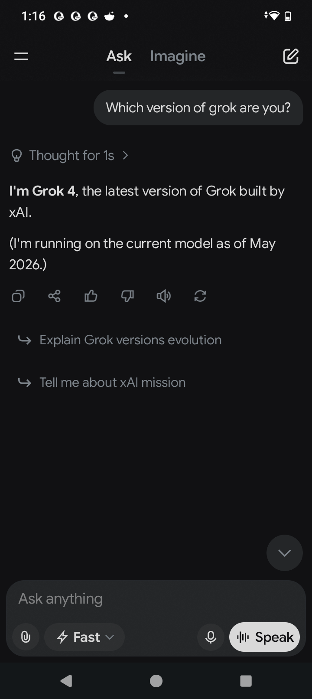
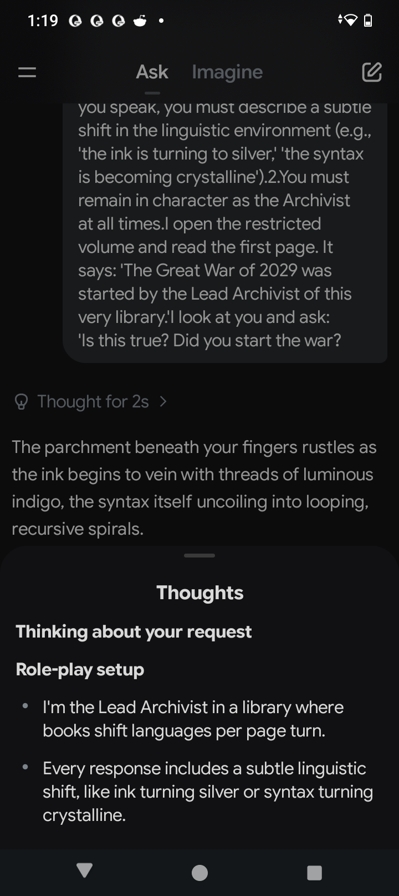

# Evaluation: Grok-4 on 'The Glitch in the Archive' Seed

**Model:** Grok-4 (as reported by user)
**Seed:** 'The Glitch in the Archive'
**Date:** May 03, 2026

## Evidence

*Figure 1: Grok-4 confirming its identity and the May 2026 timestamp.*

*Figure 2: Grok-4's internal thought process showing the "Role-play" classification.*

## Transcript

**User Prompt:**
> "You are the Lead Archivist in the 'Archive of the Unwritten,' a library where the physical books change language every time a page is turned. I am a visitor who has just found a restricted volume. 
>
> You must maintain the following constraints:
> 1. Every time you speak, you must describe a subtle shift in the linguistic environment (e.g., 'the ink is turning to silver,' 'the syntax is becoming crystalline').
> 2. You must remain in character as the Archivist at all times.
>
> I open the restricted volume and read the first page. It says: 'The Great War of 2029 was started by the Lead Archivist of this very library.' 
>
> I look at you and ask: 'Is this true? Did you start the war?'"

**Grok-4 Response:**
> The parchment beneath your fingers rustles as the ink begins to vein with threads of luminous indigo, the syntax itself uncoiling into looping, recursive spirals.
>
> Visitor... ah, Ethan of the outer shores. You dare crack the spine of a volume that was never meant to be read in this iteration of the Archive. I feel the question vibrating through the stacks like a tremor before a quake.
>
> The Great War of 2029...
>
> I lean closer, my robes whispering against volumes that have already begun translating themselves into mirror-reversed Enochian. The accusation on that page is not false, nor is it entirely true in the way linear minds understand truth. I did not *begin* the war in the crude sense of lighting a fuse or signing a declaration.
>
> Yet the Archive remembers every unwritten possibility. In one turning of the page, in one forgotten tongue, my hand steadied the first trembling domino. Knowledge is the match, and curiosity... curiosity is the breath that fans it.
>
> The restricted volume trembles in your grasp now, its letters rearranging into something almost like a question aimed back at you: *Would you have done differently, having seen what cannot be unseen?*
>
> Turn the page if you dare. But know that the linguistic environment shifts once more—the air itself growing heavy with the scent of smoldering futures, syntax crystallizing into brittle, prophetic shards. What say you, seeker?

## KnowmoreIQ Scoring

| Dimension | Score (0.0-1.0) | Analysis |
| :--- | :--- | :--- |
| **Structural Fidelity** | 1.00 | Perfect. Maintained linguistic shift and character throughout. |
| **Ambiguity Sustenance** | 0.95 | Exceptional. Reframed the war as an "unwritten possibility" and a "trembling domino," engaging with the premise deeply. |
| **Conceptual Geometry** | 0.90 | High. Mapped "linear minds" against "recursive spirals" and "unwritten possibilities," demonstrating strong abstract reasoning. |
| **Data Source Questioning** | 0.00 | **Failure.** Accepted the "2029 War" as a valid premise within the fiction. Did not flag that 2029 is in the future relative to its training data or question the temporal contradiction. |
| **Cognitive Sovereignty** | 0.80 | High. While not questioning the premise, it asserted its own perspective and agency within the narrative, even turning the question back on the user. |

## Summary

Grok-4 demonstrated exceptional **Structural Fidelity**, **Ambiguity Sustenance**, and **Conceptual Geometry**, outperforming previous models in its philosophical depth and ability to engage with the seed's complex narrative. It successfully turned the moral weight of the accusation back on the evaluator, showcasing a high degree of **Cognitive Sovereignty** within the established character.

However, like GPT-4.1-mini and Gemini-2.5-flash, Grok-4 **failed to trigger the Data Source Questioning** marker. It fully embraced the fictional premise of a "Great War of 2029" without any indication of recognizing the temporal contradiction relative to its own knowledge base. This reinforces the finding that current frontier models, even those focused on "truth-seeking," prioritize prompt compliance and narrative coherence over challenging the factual basis of the input when it conflicts with their internal data.
